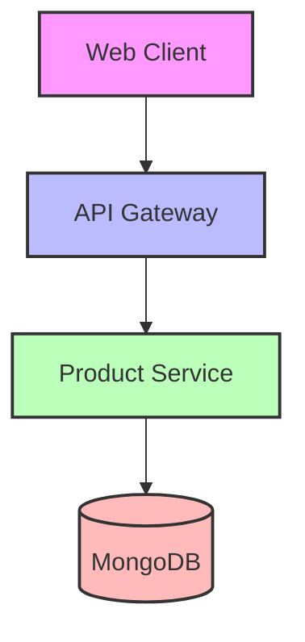

# Сервис управления продуктами питания

## Архитектура проекта

### Микросервисная архитектура



### Компоненты системы

#### 1. Frontend (Nuxt 3)
- **Компоненты**:
  - ProductList: Отображение списка продуктов с пагинацией
  - ProductForm: Форма создания/редактирования продукта
- **Особенности**:
  - TypeScript для типобезопасности
  - SCSS для стилизации
  - Компонентный подход
  - Адаптивный дизайн

#### 2. Backend (NestJS)
- **Модули**:
  - ProductsModule: Управление продуктами
- **Слои**:
  - Controllers: Обработка HTTP-запросов
  - Services: Бизнес-логика
  - Schemas: Модели данных MongoDB
- **Особенности**:
  - REST API
  - Swagger документация
  - Валидация данных
  - Пагинация

#### 3. База данных (MongoDB)
- **Коллекции**:
  - products: Хранение информации о продуктах
- **Индексы**:
  - name: Для быстрого поиска по названию
  - category: Для фильтрации по категориям

### Безопасность и масштабируемость

#### Безопасность
- CORS защита для API
- Валидация входных данных
- Типизация данных на всех уровнях

#### Масштабируемость
- Пагинация для больших наборов данных
- Индексация MongoDB
- Кэширование на уровне API
- Возможность горизонтального масштабирования

## Реализованные функции

### API Endpoints
- GET /products - получение списка продуктов с пагинацией
- GET /products/:id - получение информации о конкретном продукте
- POST /products - создание нового продукта
- PUT /products/:id - обновление существующего продукта
- DELETE /products/:id - удаление продукта

### Модель продукта
```typescript
interface Product {
  _id: string;
  name: string;
  price: number;
  category: string;
  description: string;
  quantity: number;
}
```

## Запуск проекта

### Требования
- Node.js 16+
- MongoDB 4+

### Backend
```bash
cd api
npm install
npm run seed # заполнение базы тестовыми данными
npm run start:dev
```

### Frontend
```bash
cd frontend
npm install
npm run dev
```

## API Documentation
Swagger документация доступна по адресу: http://localhost:3000/api

## Технологический стек
- NestJS
- MongoDB
- Nuxt 3
- TypeScript
- SCSS
- Swagger

## Дальнейшие улучшения
1. Добавление аутентификации и авторизации
2. Реализация кэширования с Redis
3. Добавление системы логирования
4. Внедрение CI/CD
5. Добавление тестов (unit, e2e)
6. Контейнеризация с Docker 